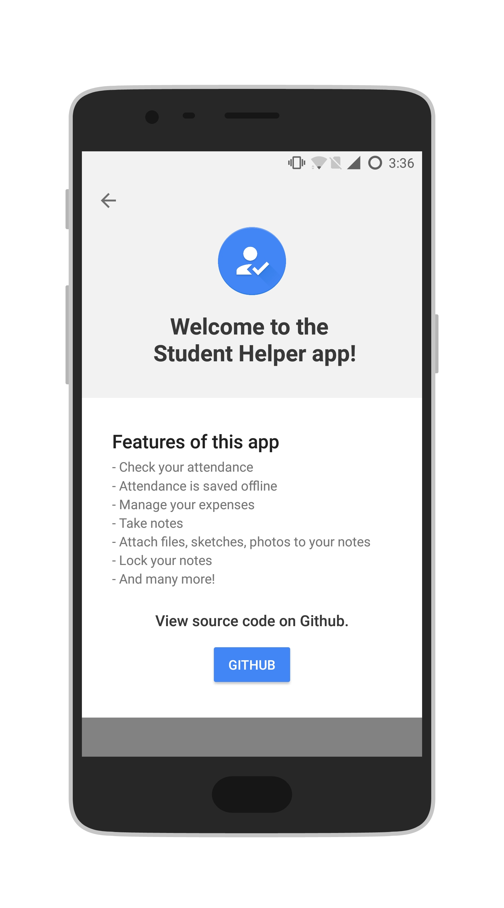
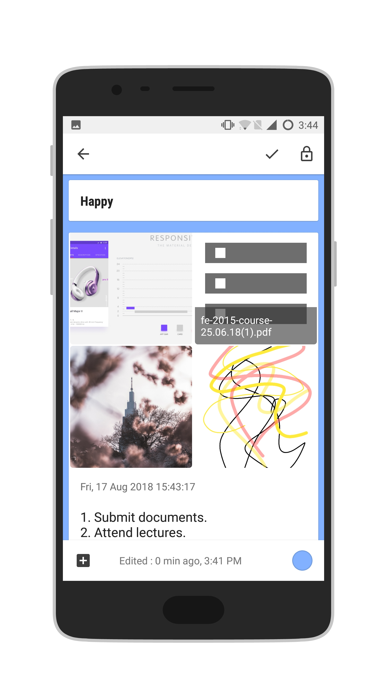

## Main Features
   

### Attendance
---
Check your attendance. 
Find out how many lectures you have bunked for a particular subject.  
Get overall attendance.

#### I couldn't provide screenshots as the PICT ETH (Attendance) server is down. I will update it later.

### Manage your expenses
---
    
- This app helps you track your expenses and budgeting which can improve your finance. 
- This app provides you the remaining balance.
- This app provides graphical representation of your expenses. 

### Take Notes
---
This app lets you add notes. 
- Attach pictures from the camera, 
- or from the file explorer  
- or create you own sketch and attach it to the note. 
- This app provides facility to set password to your note.

 
  
  

 
  

    
 
  

## The app can be downloaded from here [link](https://github.com/Piyush7890/StudentHelper/blob/master/apk/student_helper.apk)

